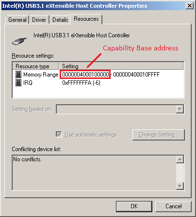
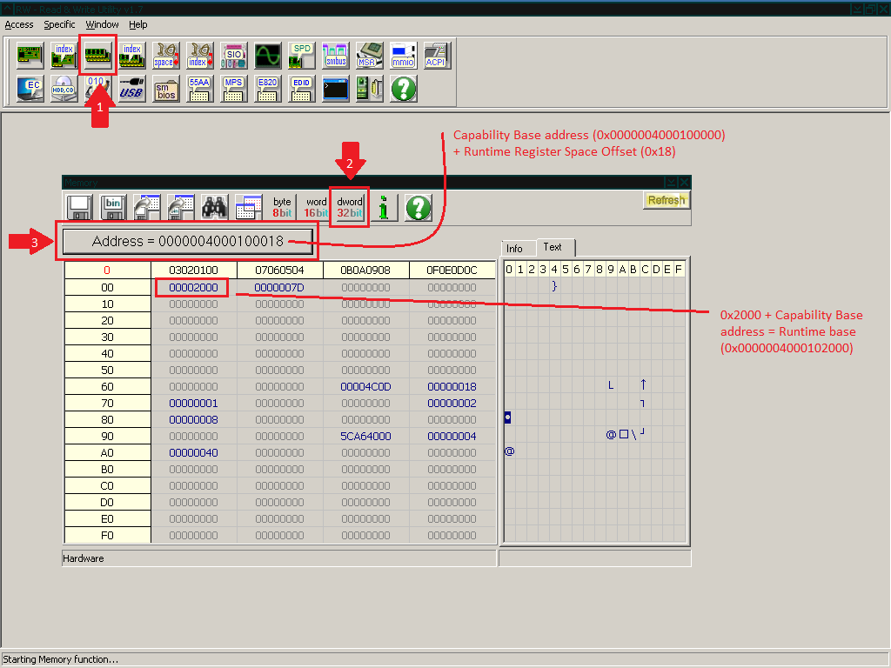
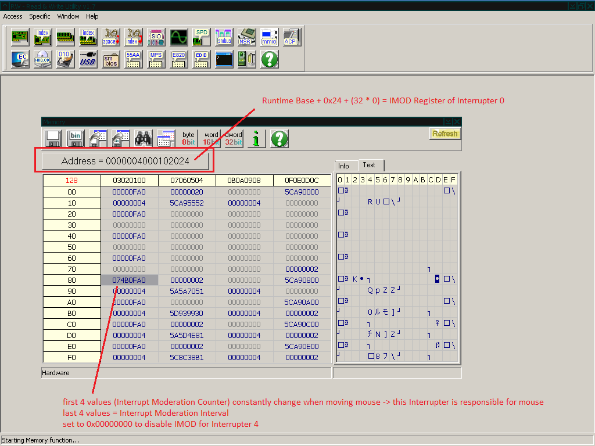

# How to persistently disable xHCI Interrupt Moderation

This section is based on [Timecard's xHCI guide](https://github.com/djdallmann/GamingPCSetup/tree/master/CONTENT/RESEARCH/PERIPHERALS#q-can-you-define-the-interrupt-moderation-rate-for-usb-controllers-do-different-versions-of-windows-have-different-default-values).

---

<details>
<summary>Click here for TLDR</summary>
</br>

Press `Windows key + R`, type `devmgmt.msc`, press `Enter`, right-click the xHCI controller, click `Properties` and navigate to `Resources`.



Open RWEverything.




There are 1024 Interrupters, so the one you're looking for may not be on the first page.


</details>

---

RWEverything has a CLI you can use to automate the whole process at Startup. Press `Windows key + R` and type `shell:startup`. Create a .bat file with the following content and replace `PATH` with the full path to RWEverything and `ADDRESS` with the Interrupter IMOD register that's responsible for your mouse.

```
"PATH\Rw.exe" /Min /NoLogo /Stdout /Command="W32 0xADDRESS 0x00000000"
```

---

If RWEverything is stuck on an address, delete the following registry key:

```
Computer\HKEY_CURRENT_USER\SOFTWARE\RW-Everything
```
