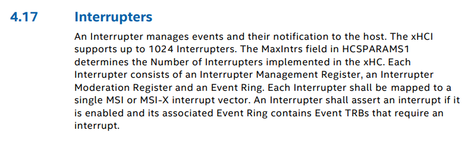
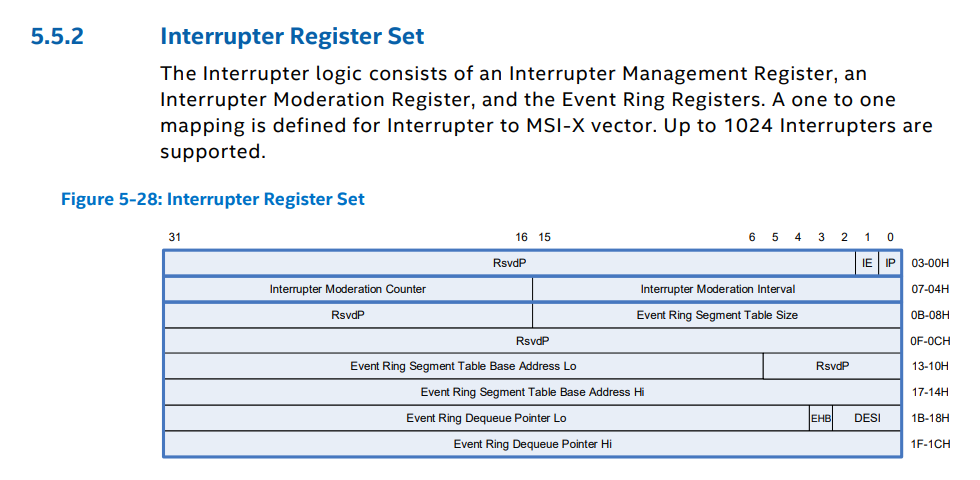

# How to persistently disable xHCI Interrupt Moderation

This section is based on [Timecard's xHCI guide](https://github.com/djdallmann/GamingPCSetup/tree/master/CONTENT/RESEARCH/PERIPHERALS#q-can-you-define-the-interrupt-moderation-rate-for-usb-controllers-do-different-versions-of-windows-have-different-default-values).

---

<details>
<summary>Click here for TLDR</summary>
</br>







Press `Windows key + R`, type `devmgmt.msc`, press `Enter`, right-click the xHCI controller, click `Properties` and navigate to `Resources`.


Open RWEverything.


The interrupter you're looking for may not always be on the first page. There can be up to 1024 interrupters; however, typically, there are less than 100. The exact count is determined by the value stored at bits 18 to 8 in the HCSPARAMS1 register (Capability base address + 0x4).

To test whether it's the correct location, set the IMOD Interval (last 4 values) to `FA00` (62.5 Hz).

The red number in the top left of the table is a decimal. Convert it to a hexadecimal before adding it to your address.

</details>

---

RWEverything has a CLI you can use to automate the whole process at Startup. Press `Windows key + R` and type `shell:startup`. Create a .bat file with the following content and replace `PATH` with the full path to RWEverything and `ADDRESS` with the Interrupter IMOD register that's responsible for your mouse.

```
"PATH\Rw.exe" /Min /NoLogo /Stdout /Command="W32 0xADDRESS 0x00000000"
```

---

If RWEverything is stuck on an address, delete the following registry key:

```
Computer\HKEY_CURRENT_USER\SOFTWARE\RW-Everything
```
